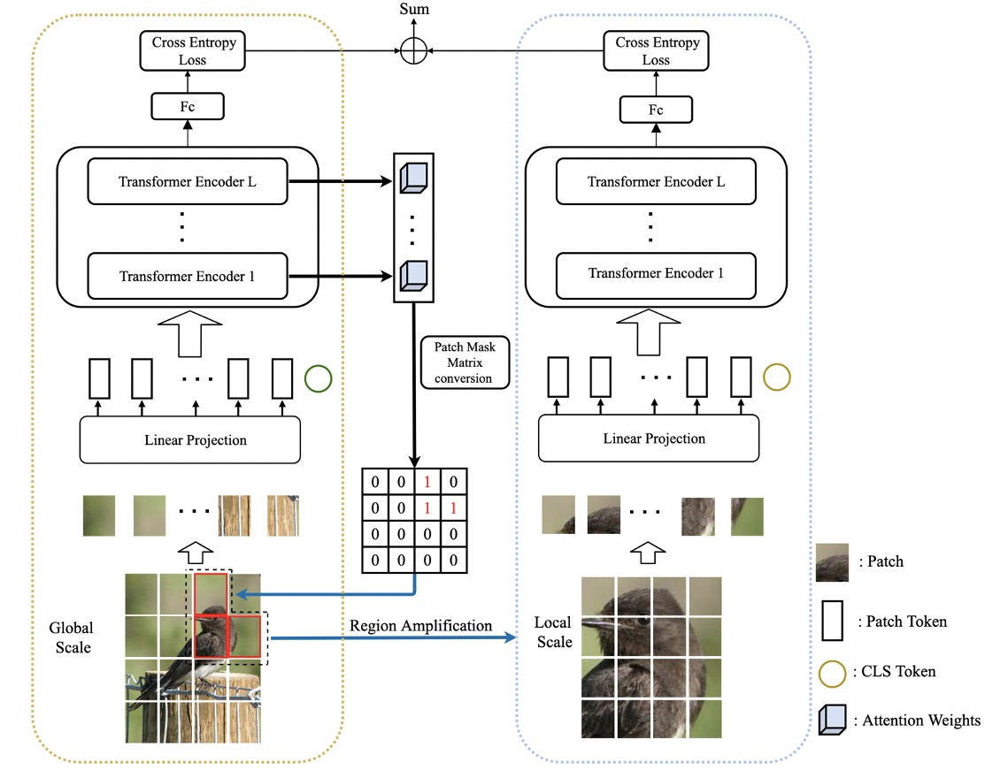
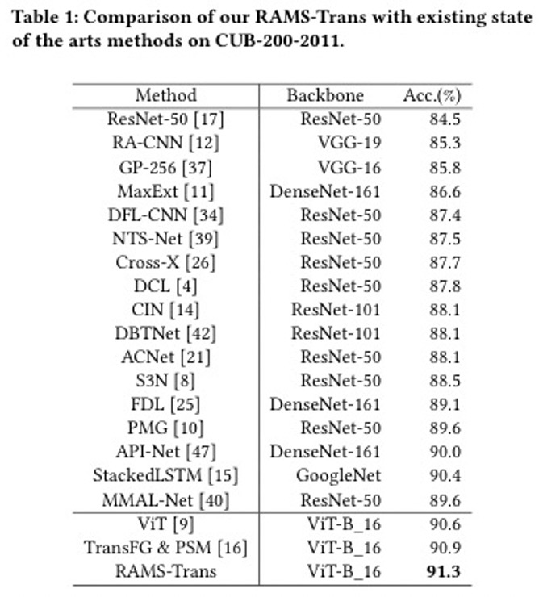

## Introduction

This  reposity contains the train code for our work RAMS-Trans: Recurrent Attention Multi-scale Transformer for Fine-grained Image Recognition. To facilitate the learning of discriminative regionattention without box/part annotations, we use the strength ofthe attention weights to measure the importance of the patch to-kens corresponding to the raw images. We propose the recurrentattention multi-scale transformer (RAMS-Trans), which uses thetransformer’s self-attention to recursively learn discriminative re-gion attention in a multi-scale manner. Specifically, at the coreof our approach lies the dynamic patch proposal module (DPPM) guided region amplification to complete the integration of multi-scale image patches. The DPPM starts with the full-size imagepatches and iteratively scales up the region attention to generatenew patches from global-to-local by the intensity of the attentionweights generated at each scale as an indicator. Our approach re-quires only the attention weights that come with ViT itself and canbe easily trained end-to-end. Extensive experiments demonstratethat RAMS-Trans performs better than concurrent works, in addition to efficient CNN models, achieving state-of-the-art results onthree benchmark datasets.

### Paper Title

**Recurrent Attention Multi-scale Transformer for Fine-grained Image Recognition**

## Results
### RAMS-Trans Framework



### Results on CUB-200:



## Usage

### Train on CUB-200

To run this code, you need two Tesla V100 GPU (64G memory). Make sure a floder named 'augments' has been created and put your dataset under '/data/datasets'.
```
python trainer_rams.py
```
## Cite this repository

```
If you find this code useful in your research, please consider citing us:
@inproceedings{hu2021rams,
  title={RAMS-Trans: Recurrent Attention Multi-scale Transformer for Fine-grained Image Recognition},
  author={Hu, Yunqing and Jin, Xuan and Zhang, Yin and Hong, Haiwen and Zhang, Jingfeng and He, Yuan and Xue, Hui},
  booktitle={Proceedings of the 29th ACM International Conference on Multimedia},
  pages={4239--4248},
  year={2021}
}
```

## Reference

This project is based on the following implementation:

[TransFG](https://github.com/TACJu/TransFG)